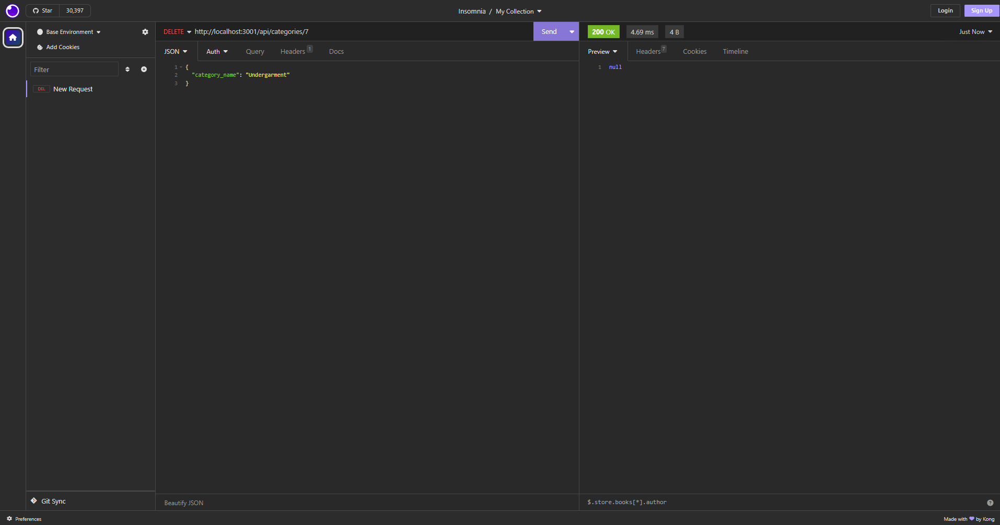

# eCommercePage

## Description
This is a simple application that allows the user to view the back-end of an eCommerce Database! If you would like to see how each item is segmented, give this a try!

## Features

1. View each Category available with it's corresponding Product
2. View each Product available with it's corresponding category id
3. View each Tag that can be put into each Product

## Installation and Usage
1. To use this application, visit the GitHub Repository and clone the code into your local computer
- After cloning the code, make sure to set up your .env file with the corresponding database, user, and password
- Boot up MySql and SOURCE the schema, then quit out of MySql
- Then open up the integrated terminal
- Run this command `npm run seed` to seed the database
- Then run this command `npm start` to start the application
- After starting the application, open your browser or Insomnia to view the databases!

## Info
Here is the [GitHub Repository!](https://github.com/Mizzymizu/eCommercePage)

Here is a video [for a brief overview of the application's features](https://www.youtube.com/watch?v=Y8jg39ePSfQ)

## Deployment Samples

